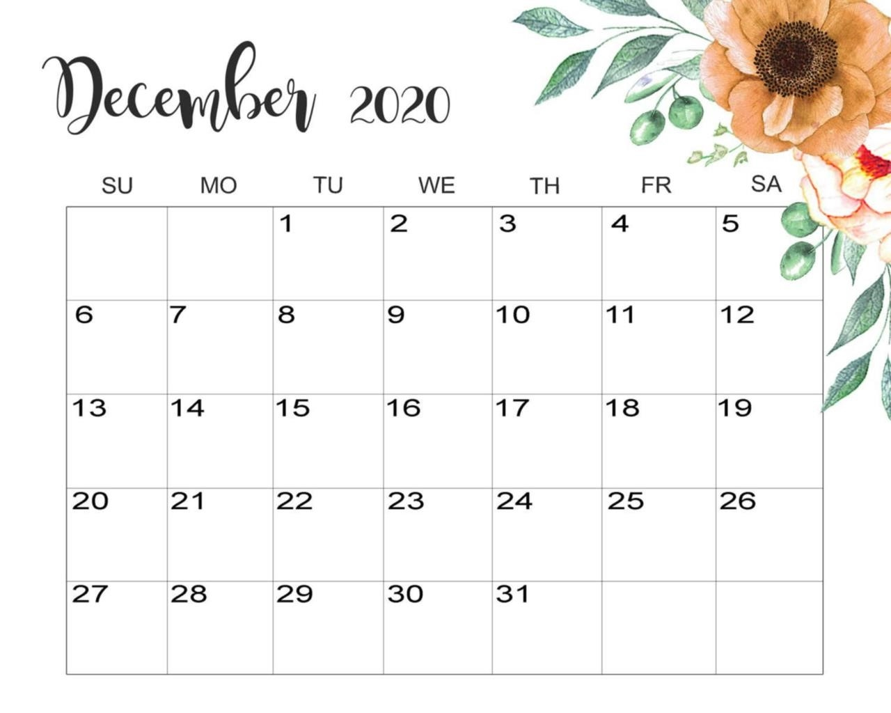

Dates are hard. No, I'm not referring to dates as in a social or romantic appointment or engagement (though I may have thought that dating was hard in my teenage/early 20s). I'm talking about working with calendar dates when programming. I tackled some serious date-related bugs this month at my job and thought I should share my experiences.

## The 13th Month

I was working on a data migration project for a web app we had integrated with Stripe. We had a CSV file with some basic customer info from an older system that we wanted to import into a newer system. As part of this, we needed to create Stripe subscriptions in the new system for each of these customers. They were already being billed in the old system, so we had to determine their next renewal date and put them on a free trial in the new system until then.

Pretty simple, right?

The CSV file contained their subscription start date. Using this date and some logic inspired by a [Stack Overflow question](https://stackoverflow.com/questions/14635901/how-do-i-get-next-occurrence-of-a-certain-day-of-the-month), we determined when the next renewal should be. I tested the script sometime in late November and everything was working beautifully. A week or two later, I had to make some adjustments to the script. When I ran it again to make sure everything was working, I was shocked to discover that it was now running indefinitely and would never create a single subscription in Stripe.

I had created an infinite loop... and a new month.

After some debugging, I realized my infinite loop was coming from a non-existent 13th month that was a condition of a while loop. Whoops! Reminds me of that old [Simpsons episode with the Smarch Calendar](https://www.youtube.com/watch?v=eR8YUj3C9lI).


I refactored the code a bit and got everything working again, no matter which day of the year I ran the script on. Here's my PHP code for determining the next renewal based on a starting date (the interval multiplier variable was used to determine if their subscription should renew every month, six months, or year):

```
$nextRenewalDate = $subStartDate;
$currentDate = date('Y-m-d');

while ($nextRenewalDate < $currentDate) {
    $nextRenewalDate = date(
        'Y-m-d',
        strtotime($nextRenewalDate . ' + ' . $intervalMultiplier . ' months')
    );
}
```

## The 53rd Week



The second date-related bug happened in another application that people use for logging time spent on different projects and tasks. Some of our clients that use this application don't have fixed pay periods, but rather a pay period that starts over every two weeks. One particular client had a pay period that went from 12/20/2020 to 01/02/2021, crossing over to the new year. When it was time to print off their time sheets, the totals weren't appearing correctly for the second week that crossed over.

The code for this application is rather complex and written in a way that isn't always simple to debug. After a few hours, I found some code that said if the start date's year is less than the end date's year, run some custom logic to get the next week's number. It looked like everything should be working. I added in some logging and saw that the week in question was week 52. There's only 52 weeks in a year, right?

Well sort of...

In PHP, when using the `date()` function, you can get the current week's number like this: `date('W')`. If you run that on the last week of the month, there's a good chance you'll get back a 53. This depends on which day January 1st falls on for the current year.

Someone that had previously worked on the time sheet functionality had hard-coded a 52. We had to refactor that code to dynamically check the week number and see if it was a 52 or 53, then go from there. In short, there are 52 weeks in a year, but the week number for the final week can be a 52 or 53.

## Final Thoughts

This is my first blog post, which is ironically on the last day of 2020, which has been a terrible year for many. I'm looking forward to 2021, all of it's challenges, and all the new things I will learn from debugging. Thanks for stopping by and Happy New Year!


